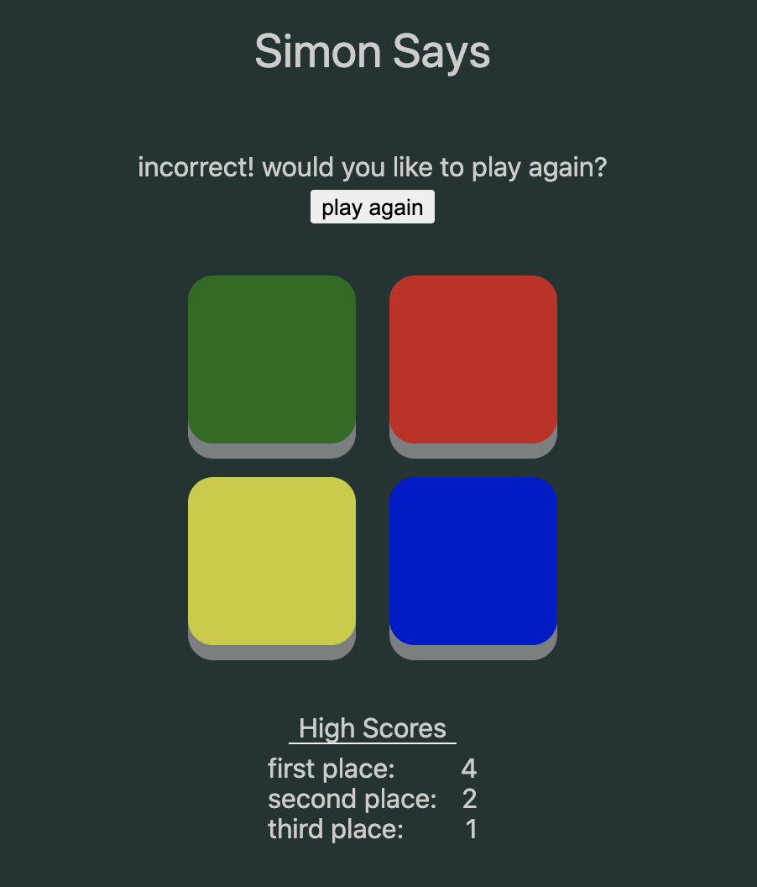

# [Simon Says](https://ahhchooey.github.io/simon_says/)

------

### Tech Stack

* JavaScript
* React

------

This is the game Simon Says. Just do as Simon says.

------

Screenshot of the game.

------

### How to Use

Click start to begin playing. Simon will then make a series of moves. After Simon is done, copy the same moves that Simon made. The first round will consist of one move. Each following round will increase the number of moves by one. Any mistake in copying Simon will result in game over.

------

